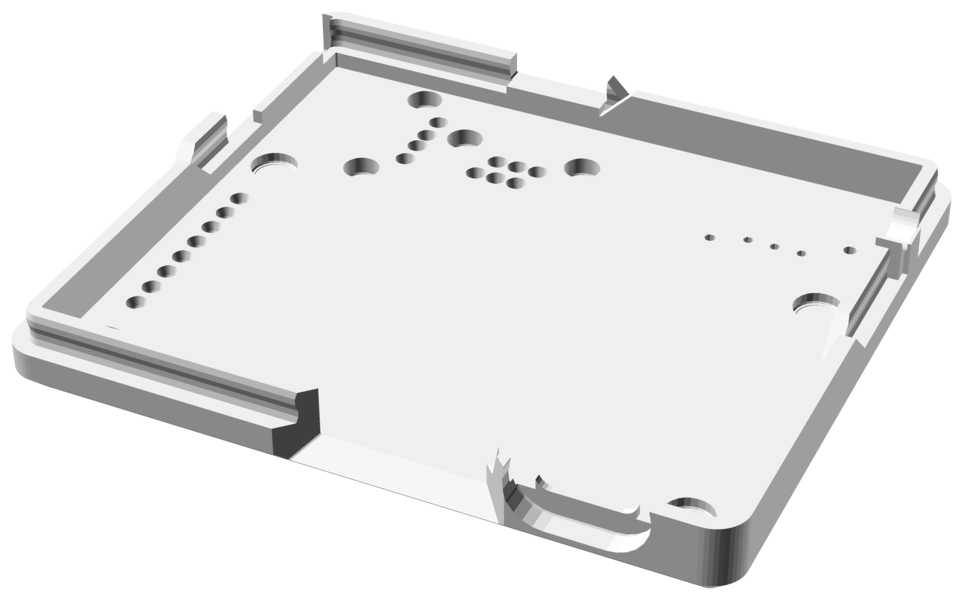
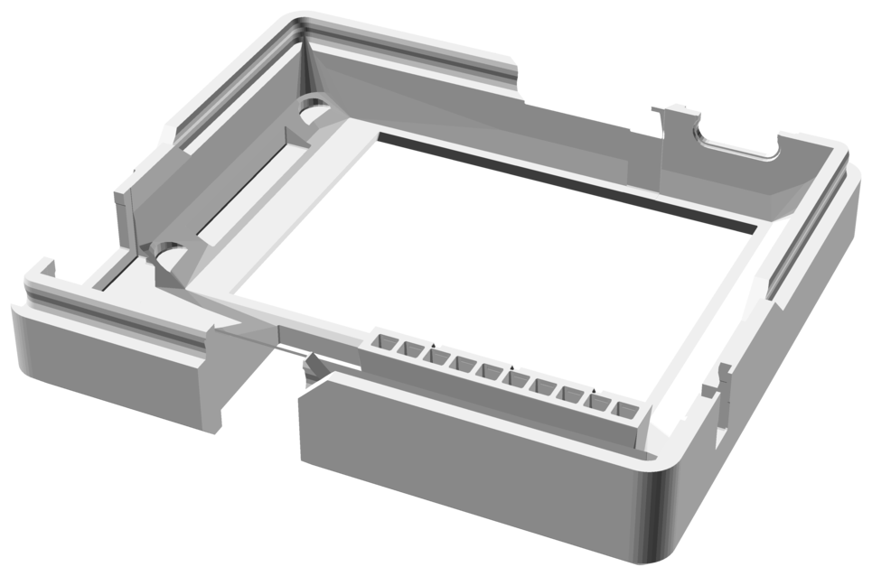
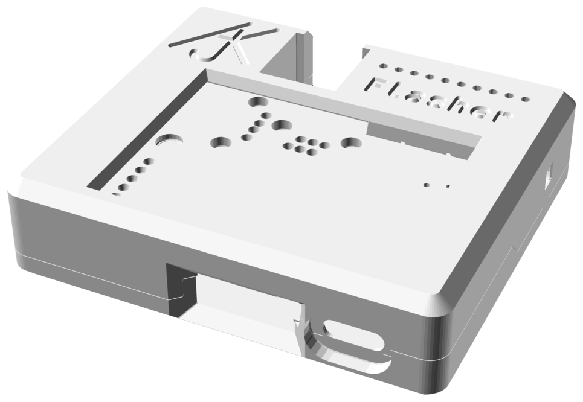
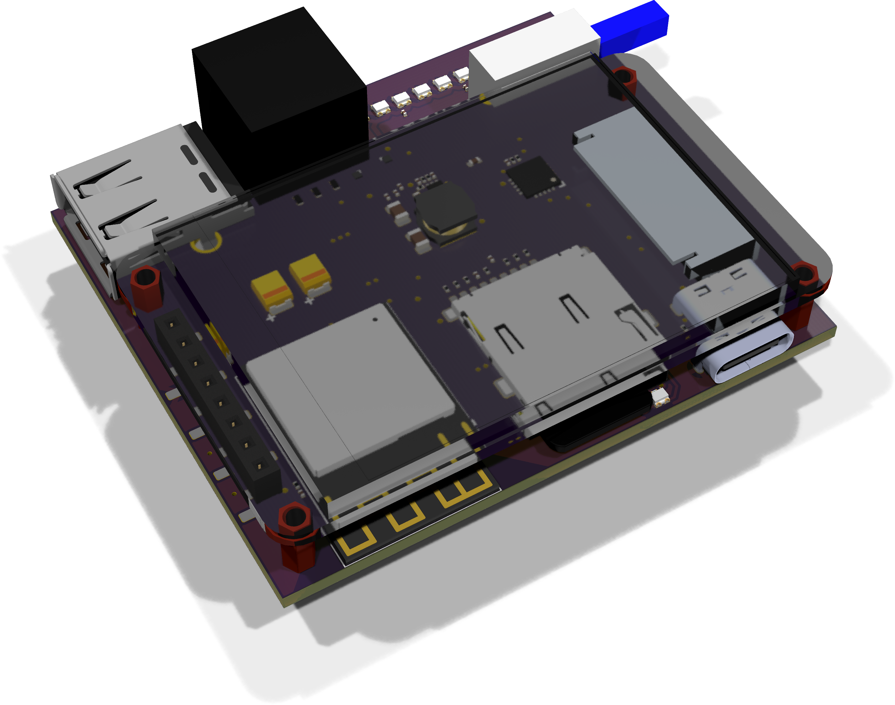
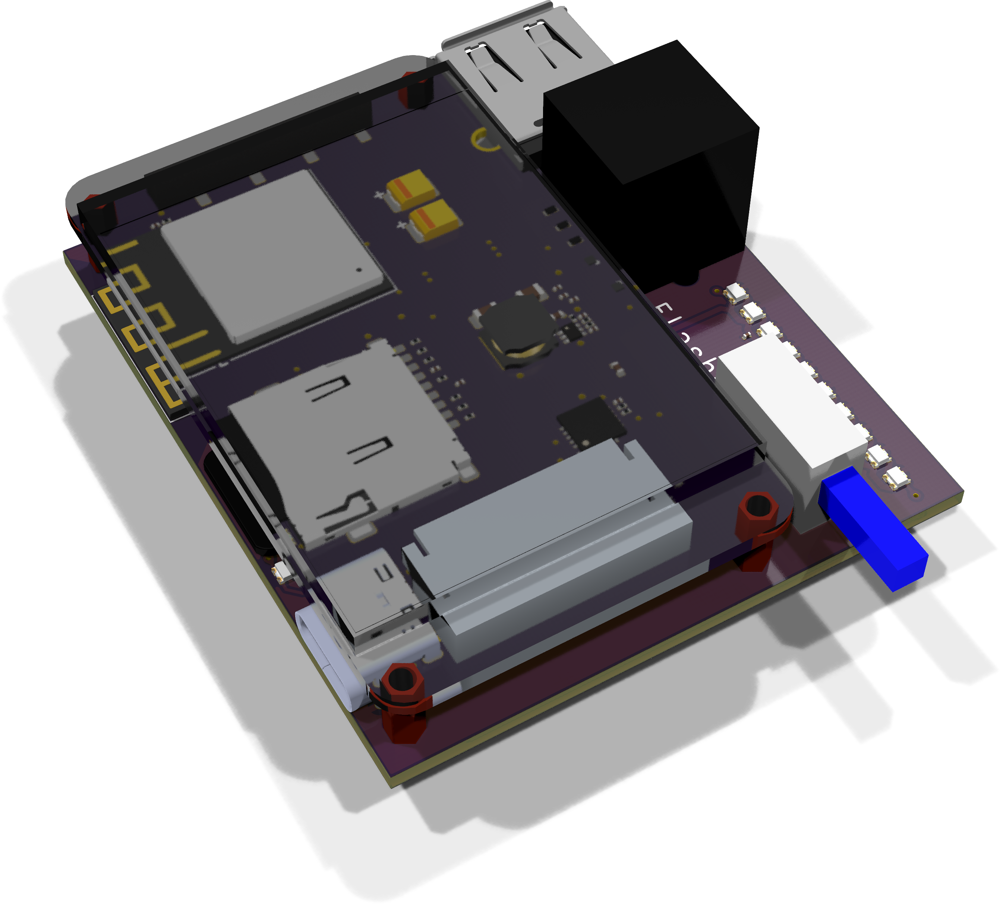
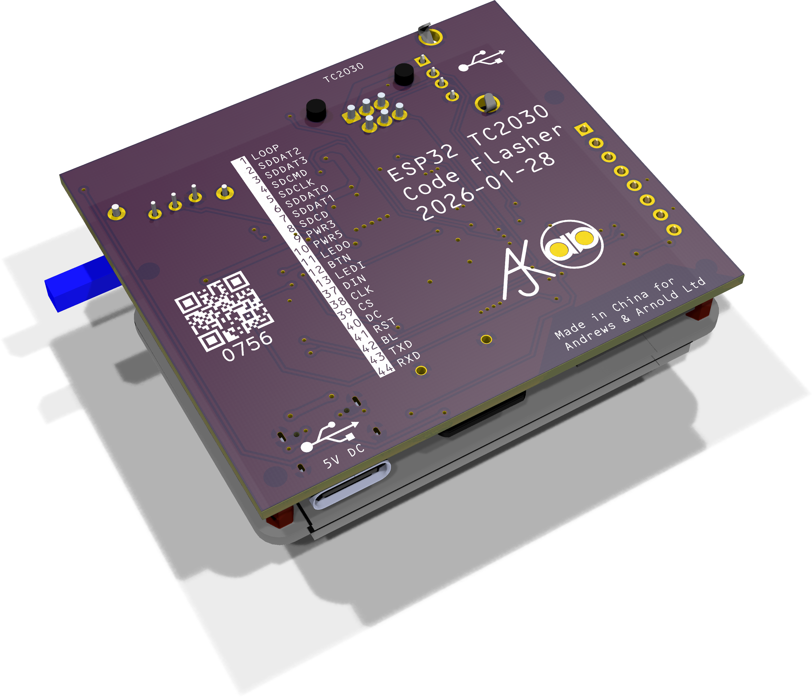
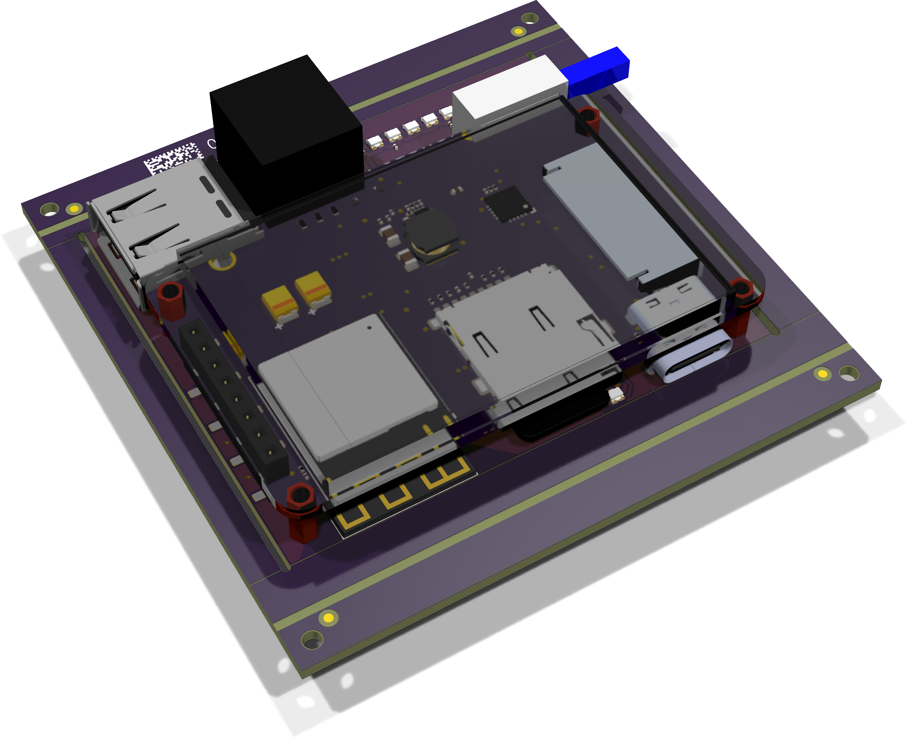
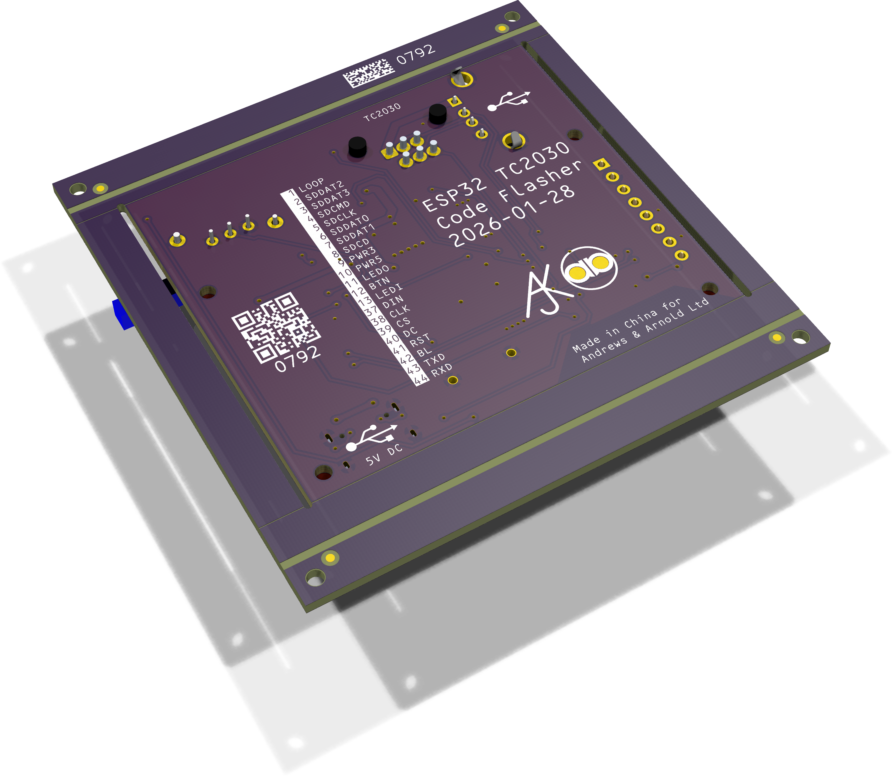

# Flasher2

## Trademark

This project is subject to the licence in the LICENCE file, and even if that says it is an open source project, you cannot sell boards or cases bearing the Andrews & Arnold Ltd name, the A&A logo, the registered trademark AJK logo or other registered trademarks, or any GS1 allocated EANs/barcode assigned to Andrews & Arnold Ltd.

## PCB Designs

These files are for use with [KiCAD](https://www.kicad.org).

- [Flasher](Flasher.kicad_pro)

## 3D

3D case designs are normally automatically created from the PCB so as to ensure correct details and placement of apertures, etc.

|Design|Bottom|Top|Combined|
|------|------|---|--------|
|Flasher||||

## PCB Images

---

*Auto generated README.md 2026-01-28T09:02:18*
