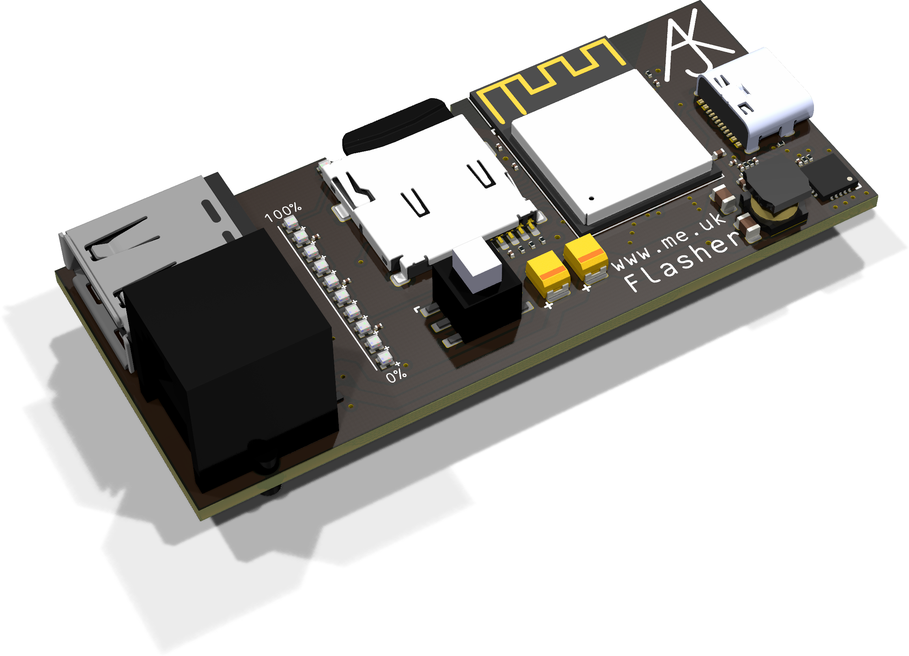

# Flasher

The Flasher board is designed to allow simple flashing of code on to an ESP device, and run the code, and confirm self test results on LEDs.

The main use case is a factory functional test with feedback of pass/fail via LEDs.

The idea is a factory worker can simply plug the lead in to a target device, see a row of LEDs light one by one, then all go green (or red if failed). This simple operation should be foolproof!

## Connections

There is a USB-C for power of the flasher and connected board, this would typically be connected to a USB charger (e.g. 2A+). This can also be used for serial debug/flashing of the flasher board itself if needed.

There is a USB-A connector which can be used to connect via USB to a target device. This could be via a normal USB lead (e.g. USB-A to USB-C) or via tag-connect lead such as [TC2030-USB-NL](https://www.tag-connect.com/product/tc2030-usb-nl) or a tag-connect USB to serial lead such as TC2030-NL-FTDI lead.

There is a 6 pin RJ12 connector which is primarilly intended to be used with a tag-connect [TC2030-MCP-NL-10](https://www.tag-connect.com/product/tc2030-mcp-nl-10-6-pin-cable-with-rj12-modular-plug-for-microchip-icd-10-version) lead. This can be used for direct USB flashing boards with USB TC2030 pads.

|Pin|USB|Serial|
|---|---|------|
|1|5V|3.3V|
|2|Loop|Boot|
|3|D-|Rx|
|4|D+|Tx|
|5|GND|GND|
|6|Loop|Boot|

Note *loop* is a connection between contacts 2 and 6 to allow a target device to use this for a loop back ATE test. These are not used for USB.

For serial this is slightly non standard as tag-connect has `DTR` on 2 and `RTS` on 6, but these are looped and used for *boot* (i.e. `DTR`). For such usage the *boot* would be connected to GPIO0 allowing power control of the 3.3V to reset the device rather than using a `RTS` connection. If `RTS` is connected on the device it may be necessary to disconnect pin 6 to avoid holding a device in reset after power on with `*boot* low for programming.

Note also that the board is desigend to provide 5V (USB incoming pass through) or 3.3V to the power output so it can be used with devices needing either voltage.

## Basic operation

The basic operation is as follows...

1. Connect power to flasher (USB-C)
2. Ensure SD card inserted (LED shows green)
3. Connect to target device
4. Row of LEDs progress blue to show flashing progress
5. Row of LEDs go all green as ATE test pass
6. Target device may also indicate green LED depending on target code

Failure modes

1. Nothing happens when connecting to target device (this indicates serious issue with target device)
2. SD card flashes red/green - this means no code present to flash target device - check device type and code on SD card
3. After blue LED sequence all LEDs show red (this indicates device flashed but failed ATE)
 
## LEDs

An LED by the SD card shows green for SD card, yellow for no SD card, red for SD card not mounted. As above red/green flashing means SD card does not contain necessary code for device.

A row of 10 LEDs indicates progress, liging/changing one LED at a time for 10% of progress.

|Colour|Meaning|
|------|-------|
|Off|Waiting for device|
|Single orange|USB connected, checking|
|Off to blue|Flashing device|
|All green|ATE passed|
|Half red/green|Code seems to be running but no ATE status|
|All or some red|ATE failed|
|Blue to cyan|Verifying flashed device|
|Blue to off|Erasing device|
|Off to yellow|Flasher s/w upgrade or SD file upload in progress|

## Button

The button *may* have uses, proposed as follows...

1. When no target device, cycles an LED in the row of 10 LEDs to select s/w to use from SD card for next flash.
2. When target device connected (pass or fail or even flashing), starts a full flash erase and program cycle.

## SD card file format

The card format expects a directory for each device type. This consists of device tytpe, version, if `MC` (multicore), ROM and RAM size.

E.g. `ESP32S3NCN4R2` would be an ESP32-S3 multi-core with 4M flash and 2M SPI RAM

Within this directory may be either :-

1. `image.bin` a single image for the device flashed from `0x00000`

Or a set of files...
 
1. `*-bootloader.bin` (expects only one file matching that format), the bootloader to flash at `0x0000`
2. `partition-table.bin` the partition table to flash at `0x08000`
3. `ota_data_initial.bin` to flash at partition table location `otadata`
4. `*.bin` (one file that is not one of the above) application to flash at `ota_0` location from partition table

If we do multiple choice flashing based on button, then a sub-directory called `0` to `9` would be used for the selected image, containing files as above. It may also be that `imageN.bin` is accepted as a simpler way.

TODO: Would be smart to have a URL for files, as a file, in the directory, so they can be checked for an update automatically. Maybe even some sort of manifest.

## Target code

Target code should output a line of text on the serial consule within five seconds of starting that is either... 

`ATE: PASS`

or

`ATE: FAIL`

A failure to send either will indicate fail.

I may allow more options, perhaps number of LEDs to indicate type of failure.

This should be done using a simple `printf` and not an `ESP_LOG` as (a) the logs can be disabled, and (b) the logs have colour codes.
